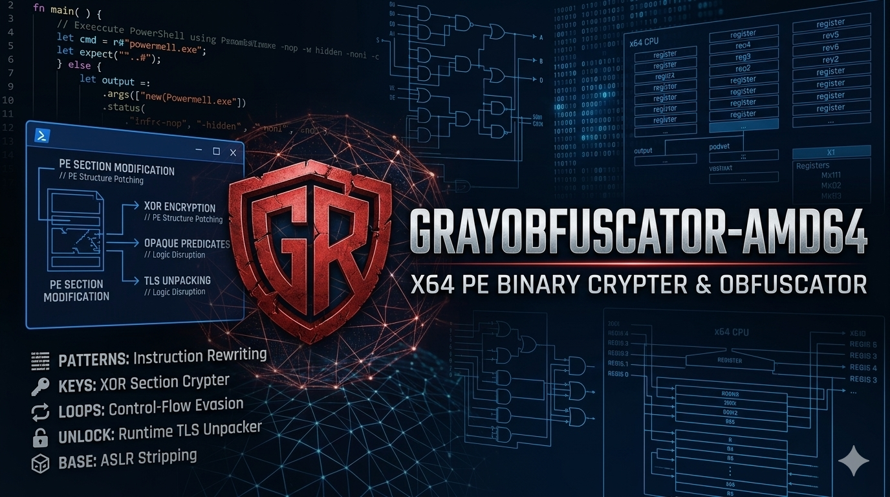

  

# GrayObfuscator-amd64
A prototype utility demonstrating low-level x64 Portable Executable (PE) structural modifications and obfuscation techniques.

## Winx86_64-PE-Crypter-Obfuscator
This is a prototype tool where I demonstrated how security concepts like PE structural modifications, section encryption, and TLS callbacks operate under the hood.

### How it works?
The project processes 64-bit Windows executables (`.exe`) to mask their underlying code layout and disrupt static reverse engineering tools:
* **Instruction Patching:** Substitutes byte alignment sequences with multi-byte NOP equivalents.
* **XOR Obfuscation:** Encrypts executable code sections using a static byte-key pattern to break static signature detection.
* **Control-Flow Evasion:** Injects opaque predicates and anti-disassembly loops into the section slack space.
* **TLS Callback Unpacking:** Injects a custom `.tls` section containing an x64 assembly stub that seamlessly decrypts the code layer in memory at runtime prior to the binary's main entry point.
* **ASLR Stripping:** Clears the `DYNAMIC_BASE` header flag to guarantee predictable base memory addressing.

### Medium Article
[Click here to open the article](https://medium.com)

---

## Defensive & Educational Disclaimer
This repository is published strictly for defensive security research, reverse-engineering analysis, and threat hunting training. The code represents a proof-of-concept utility to assist security professionals and software analysts in understanding evasion signatures and structural binary manipulation tactics. It is not intended for unauthorized deployment.
